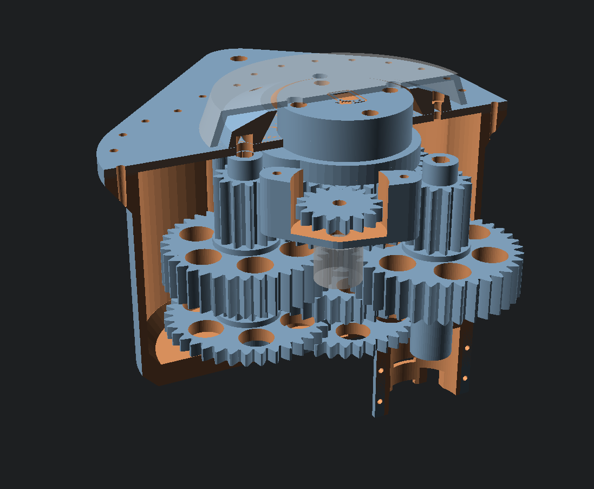
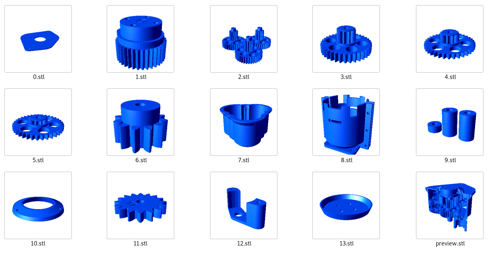

# Parameterizable 3D print Antenna rotator in OpenScad
- Three predefined size (S,M,XL)
- Included terminal for install motor from cordless drill
- Without nuts (tapered holes)
- DXF export lasered steel cover
- BOM included
- With Azimuth potentiometer (M,XL)
- With Homing endstop, for uing with stepper motor (M,XL)

## Output files
- Source [OpenScad file](parametric-3d-rotator.scad) for design customisation

### S size
(compromise design without endstop and azimuth potentiometer)
- [BOM](S.echo)
- Steel cover [.DXF](S.DXF)
- Steel output terminal [.DXF](Sout.DXF)
- All [.STL](/S)
- [S_in.3mf](S_in.3mf)
- [S_out.3mf](S_out.3mf)

### M size (recomended)

- Max torque **2200 kg/cm (215 N/m)**
- [Torque video](https://www.youtube.com/watch?v=XpkWt55Bdf4)
- [BOM](M.echo)
- Steel cover [.DXF](M.DXF)
- Steel output terminal [.DXF](Mout.DXF)
- All [.STL](/M)
- [M_in.3mf](M_in.3mf)
- [M_out.3mf](M_out.3mf)

### XL size
- [BOM](XL.echo)
- Steel cover [.DXF](XL.DXF)
- Steel output terminal [.DXF](XLout.DXF)
- All [.STL](/XL)
- [XL_in.3mf](XL_in.3mf)
- [XL_out1.3mf](XL_out1.3mf)
- [XL_out2.3mf](XL_out2.3mf)

* [Homepage](https://remoteqth.com/3d-rotator.php)

* [OpenScad](https://openscad.org/)
